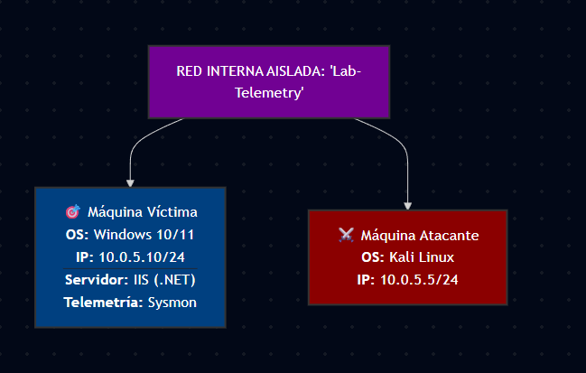

# 🔬 Lab Técnico: Explotación de Path Traversal (OWASP A01:2021) y Telemetría de Endpoint en Entornos IIS/.NET

## 📋 Descripción del Escenario
Este laboratorio práctico documenta el despliegue, explotación y posterior análisis forense de una vulnerabilidad de **Control de Acceso Roto (Broken Access Control)**, específicamente un **Path Traversal / Arbitrary File Read (CWE-22 / CWE-73)**. 

El objetivo es simular el ciclo de vida completo de un ataque controlado en un entorno empresarial basado en la pila tecnológica de Microsoft, aplicando metodologías ofensivas y recolectando telemetría avanzada mediante **Sysmon** para emular las capacidades de un analista SOC / Incident Responder de nivel corporativo.

---

## 🗺️ Matriz de Mapeo de Threat Intelligence

| Componente | Identificador / Framework | Clasificación / Táctica |
| :--- | :--- | :--- |
| **Categoría OWASP** | Top 10:2021 - A01 | Broken Access Control |
| **Debilidad Mitre** | CWE-22 / CWE-73 | Path Traversal / File Access |
| **Framework NIST** | SP 800-53 Rev. 5 | AC-3 (Access Enforcement) / AU-6 (Audit Review) |
| **Táctica MITRE ATT&CK (Red)** | T1190 / T1083 | Exploit Public-Facing Application / File & Directory Discovery |
| **Táctica MITRE ATT&CK (Blue)** | T1078 / DS0009 | Valid Accounts / Process Creation Logs (Sysmon) |

---

## 🛠️ Fase 1: Despliegue de la Infraestructura e Ingeniería de Red

Para contener los artefactos ofensivos y evitar fugas de tráfico hacia la red doméstica o Internet, la arquitectura se despliega en un entorno de red lógicamente aislado.



### Paso 1.1: VirtualBox Hypervisor Network Hardening
Ambas máquinas virtuales deben configurarse en caliente o apagadas con los siguientes parámetros de aislamiento:

1. Dirígete a **Configuración (Settings) ➡️ Red (Network)**.
2. En *Conectado a*, selecciona **Red interna (Internal Network)**.
3. Define el ID de red en el campo *Nombre* exactamente como: `Lab-Telemetry`.
4. Despliega *Avanzadas* y en *Modo promiscuo*, selecciona **Permitir todo** (indispensable para intercepción pasiva y análisis posterior de paquetes con Wireshark).

> 📸 **[Captura 01 - Aislamiento de Red en Hypervisor]* -- **maquina victima**
> ``

> 📸 **[Captura 01 - Aislamiento de Red en Hypervisor]* -- **maquina victima**
> ``

---

## 🪟 Fase 2: Configuración del Target (Víctima - Windows Server/Workstation)

### Paso 2.1: Asignación de Direccionamiento IP Estático
Ante la ausencia de un servidor DHCP en la celda aislada, se procede a la configuración manual del stack TCP/IP.

1. Ejecuta `Win + R`, escribe `ncpa.cpl` y presiona `Enter`.
2. Haz clic derecho en el adaptador de red ➡️ **Propiedades**.
3. Selecciona **Protocolo de Internet versión 4 (TCP/IPv4)** ➡️ **Propiedades**.
4. Setea los siguientes parámetros estáticos:
   * **Dirección IP:** `10.0.5.10`
   * **Máscara de subred:** `255.255.255.0`
   * **Puerta de enlace / DNS:** *Dejar completamente en blanco (No Route to Internet).*

> 📸 **[Captura 02 - Interfaz TCP/IPv4 en Windows]**
> *Captura la ventana de propiedades de TCP/IPv4 con los datos IP estáticos ingresados.*
> ``

### Paso 2.2: Provisionamiento del Servidor Web IIS (Internet Information Services)
Instalación de las características nativas de Windows para soportar la aplicación web corporativa.

1. Ejecuta `Win + R`, escribe `optionalfeatures` y presiona `Enter`.
2. Localiza **Internet Information Services** en el árbol de características y marca la casilla principal.
3. Despliega **Servicios World Wide Web** ➡️ **Características de desarrollo de aplicaciones** y activa **ASP.NET** (versión 4.8 o superior).
4. Haz clic en **Aceptar**, espera la finalización del proceso de instalación y reinicia si el sistema lo requiere.
5. **Validación:** Abre un navegador local e ingresa a `http://localhost`. Debe renderizar la interfaz por defecto de IIS.

> 📸 **[Captura 03 - Verificación del Servicio IIS]**
> *Captura del navegador web mostrando la landing page por defecto de IIS (inetpub).*
> ``

### Paso 2.3: Inyección del Código Vulnerable (Weaponization Local)
Por defecto, el directorio raíz (Document Root) de IIS está ubicado en `C:\inetpub\wwwroot\`.

1. Crea un directorio de trabajo llamado `lab` dentro de `C:\inetpub\wwwroot\`.
2. Genera un archivo semilla de prueba en `C:\inetpub\wwwroot\lab\welcome.txt` con la cadena: `"Bienvenido al laboratorio de telemetría de Pietro."`
3. En el mismo directorio, crea el script de procesamiento dinámico `view.aspx`. Abre el archivo con un editor de texto plano e inyecta el siguiente código en C#, el cual expone una falla crítica de sanitización de entradas que permite la manipulación de rutas arbitrarias:

```asp
<%@ Page Language="C#" %>
<%@ Import Namespace="System.IO" %>
<!DOCTYPE html>
<html>
<head>
    <title>Visualizador de Documentos Corporativos</title>
</head>
<body>
    <h2>Repositorio de Archivos Internos</h2>
    <hr />
    <%
        // SINK VULNERABLE: Recibe el parámetro 'file' sin procesos de sanitización o validación (Whitelisting)
        string fileParam = Request.QueryString["file"];
        
        if (!string.IsNullOrEmpty(fileParam))
        {
            try
            {
                // Insecure Path Combination: Permite secuencias de escape estilo '../'
                string basePath = Server.MapPath("~/lab/");
                string fullPath = Path.Combine(basePath, fileParam);

                // Lectura arbitraria de archivos del sistema de archivos local (File System)
                string fileContent = File.ReadAllText(fullPath);
                Response.Write("<pre>" + Server.HtmlEncode(fileContent) + "</pre>");
            }
            catch (Exception ex)
            {
                Response.Write("<p style='color:red;'>Error al cargar el archivo: " + Server.HtmlEncode(ex.Message) + "</p>");
            }
        }
        else
        {
            Response.Write("<p>Por favor, especifica un archivo usando el parámetro ?file= (Ejemplo: view.aspx?file=welcome.txt)</p>");
        }
    %>
</body>
</html>
```


